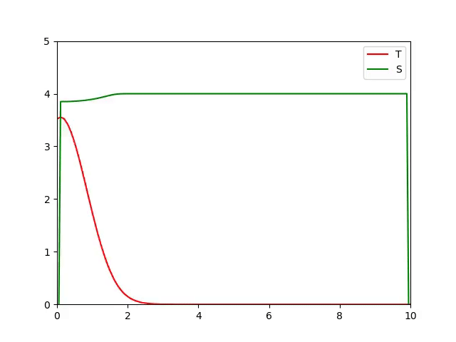
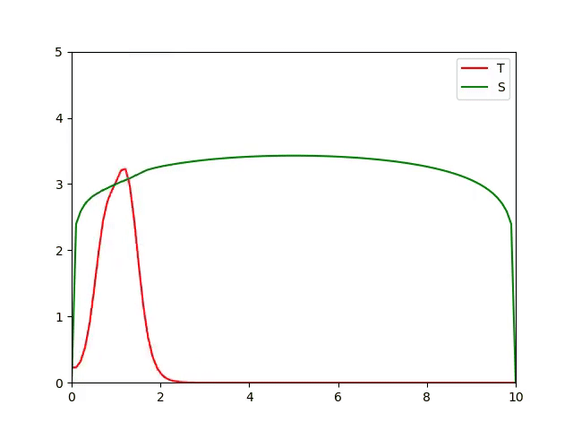

# Wild Fire

<div align="center">
  
</div>

## Heat Equation

Solve the heat equation of the following form using the Crank-Nicolson scheme:

```math
\begin{split}
  u_t &= u_xx, x \in [a, b], t \in (0, T]\\
  u(x, 0) &= u_0(x)\\
  h_a(t) &= c_a(t)u(a, t) + d_a(t)u_x(a, t)\\
  h_b(t) &= c_b(t)u(b, t) + d_b(t)u_x(b, t)
\end{split}
```

```
def heat_equation(a,b,T,N_x,N_t,u_0,c_a,d_a,h_a,c_b,d_b,h_b):
    """
    Parameters:
    a: float
    b: float, a < b
    T: positive float
    N_x: positive integer, N_x > 2, N_x = numer of mesh nodes in x
    N_t: positive integer, N_t > 1, N_t = number of mesh nodes in t
    u_0: function handle for the initial function auxiliary condition
    c_a: function handle
    d_a: function handle
    h_a: function handle
    c_b: function handle
    d_b: function handle
    h_b: function handle
    
    Returns:
    U: a two dimensional numpy array containing floats.
       Rows correspond to time and columns to x.
    """
    x = np.linspace(a, b, N_x)
    t = np.linspace(0, T, N_t)
    h = x[1] - x[0]
    k = t[1] - t[0]
    lmda = k / (2*h**2)
    
    ha = h_a(t)
    ca = c_a(t)
    da = d_a(t)
    
    hb = h_b(t)
    cb = c_b(t)
    db = d_b(t)
    
    A = sp.diags([lmda, 1-2*lmda, lmda], [-1, 0, 1], shape=(N_x-2, N_x-2))
    B = sp.diags([-lmda, 1+2*lmda, -lmda], [-1, 0, 1], shape=(N_x-2, N_x-2))
    
    U_j = u_0(x)
    U = [U_j]
    for i in range(N_t - 1):
        U_at = U_j[0]
        U_bt = U_j[-1]
        U_ = U_j[1:-1]
        
        coef1_a = ha[i] / (ca[i] - da[i]/h)
        coef2_a = da[i] / (h*ca[i] - da[i])
        coef1_b = hb[i] / (cb[i] + db[i]/h)
        coef2_b = db[i] / (h*cb[i] + db[i])
        
        AU = A@U_
        AU[0] += lmda*U_at + lmda*coef1_a
        AU[-1] += lmda*U_bt + lmda*coef1_b
        
        B_ = B.tocsr().copy()
        B_[0,0] -= lmda*coef2_a
        B_[-1,-1] -= lmda*coef2_b 
        
        U1_ = spsolve(B_, AU)
        Ua = coef1_a - coef2_a * U1_[0]
        Ub = coef1_b - coef2_b * U1_[-1]
        U_j = np.concatenate([[Ua], U1_, [Ub]])
        U.append(U_j)
        
    return np.array(U)
```

## BFGS

Use BFGS (Broyden–Fletcher–Goldfarb–Shanno algorithm) to minimize a function $f:\mathbb{R}^n \to \mathbb{R}$:

```
def bfgs(Df, x0, maxiter=100, tol=1e-5):
    Parameters:
        Df (function): The first derivative of f. Accepts and returns a NumPy
            array of shape (n,).
        x0 ((n,) ndarray): The initial guess.
        maxiter (int): The maximum number of iterations to compute.
        tol (float): The stopping tolerance.

    Returns:
        ((n,) ndarray): The approximate optimizer of f.
        (bool): Whether or not the algorithm converged.
        (int): The number of iterations computed.
    """
    # Keep track of convergence and number of iterations
    converged = False
    iterations = 0
    n = len(x0)
    A_inv = np.eye(n)
    dfx = Df(x0)
    # Loop maxiter number of times before convergence 
    for i in range(maxiter):
        iterations += 1
        # Equation 12.6
        x1 = x0 - A_inv@dfx
        # Condition for convergence
        if la.norm(dfx) < tol:
            converged = True
            break
        # Store all necessary values for efficiency
        s = x1 - x0
        dfx1 = Df(x1)
        y = dfx1 - dfx
        dfx = dfx1
        sy = np.dot(s,y)
        # Avoid dividing by 0
        if sy == 0:
            break
        # Equation 12.7
        A_inv += ((np.dot(s,y) + np.dot(y, A_inv@y))*np.outer(s,s))/(sy**2) \
                 - (A_inv@np.outer(y,s) + np.outer(s,y)@A_inv)/sy
        # Update x0
        x0 = x1

    return x1, converged, iterations
```

## Burgers' Equation

The nonlinear implicit Crank-Nicholson equations for the Burgers' equation:

```
def f(U1, U0, K1, K2, dx, ha_i, ca_i, da_i, hb_i, cb_i, db_i):
    """
    Parameters
    ----------
        U1 (ndarray): The values of U^(n+1)
        U0 (ndarray): The values of U^n
        s (float): wave speed
        K1 (float): first constant in the equations
        K2 (float): second constant in the equations
    
    Returns
    ----------
        out (ndarray): The residuals (differences between right- and 
                    left-hand sides) of the equation, accounting 
                    for boundary conditions
    """
    coef1_a = ha_i / (ca_i - da_i/dx)
    coef2_a = da_i / (dx*ca_i - da_i)
    coef1_b = hb_i / (cb_i + db_i/dx)
    coef2_b = db_i / (dx*cb_i + db_i)
    
    RHS = U1[1:-1] - U0[1:-1]
    LHS1 = K1*((U1[1:-1] + U0[1:-1]) * \
               (U1[2:] - U1[:-2] + U0[2:] - U0[:-2]))
    LHS2 = K2*(U1[2:] - 2*U1[1:-1] + U1[:-2] + \
               U0[2:] - 2*U0[1:-1] + U0[:-2])
    
    residual = RHS - (LHS1 + LHS2)
    boundary_a = U1[0] - (coef1_a - coef2_a*U1[1])
    boundary_b = U1[-1] - (coef1_b - coef2_b*U1[-2])
    
    out = np.concatenate([[boundary_a], residual, [boundary_b]])
    return out
```

Solve the Burgers equation of the following form using the Crank-Nicolson scheme:

```math
\begin{split}
  u_t + u*u_x &= u_xx, x ∈ [a, b], t ∈ (0, T]\\
  u(x, 0) &= u_0(x)\\
  h_a(t) &= c_a(t)u(a, t) + d_a(t)u_x(a, t)\\
  h_b(t) &= c_b(t)u(b, t) + d_b(t)u_x(b, t)
\end{split}
```

```
def burgers_equation(a,b,T,N_x,N_t,u_0,c_a,d_a,h_a,c_b,d_b,h_b):
    """
    Parameters:
    a: float
    b: float, a < b
    T: positive float
    N_x: positive integer, N_x > 2, N_x = numer of mesh nodes in x
    N_t: positive integer, N_t > 1, N_t = number of mesh nodes in t
    u_0: function handle for the initial function auxiliary condition
    c_a: function handle
    d_a: function handle
    h_a: function handle
    c_b: function handle
    d_b: function handle
    h_b: function handle
    
    Returns:
    U: a two dimensional numpy array containing floats.
       Rows correspond to time and columns to x.
    """
    x = np.linspace(a, b, N_x)
    t = np.linspace(0, T, N_t)
    dx = x[1] - x[0]
    dt = t[1] - t[0]
    
    ha = h_a(t)
    ca = c_a(t)
    da = d_a(t)
    
    hb = h_b(t)
    cb = c_b(t)
    db = d_b(t)
    
    K1 = -dt / (8*dx)
    K2 = dt / (2*dx**2)
    
    U0 = u_0(x)
    U = [U0]
    for i in range(N_t - 1):
        def g(U1):
            return f(U1, U0, K1, K2, dx, ha[i], ca[i], da[i], hb[i], cb[i], db[i])
        
        U1, conv, iterations = bfgs(g, U0)
        U.append(U1)
        U0 = U1
    
    return np.array(U)
```

## Wild Fire Model

The nonlinear implicit Crank-Nicholson equations for the Wildfire model:

```
def f(TS1, TS0, K1, K2, K3, K4, B, C1, dx, N_X,
      hTa_i, cTa_i, dTa_i, hTb_i, cTb_i, dTb_i, 
      hSa_i, cSa_i, dSa_i, hSb_i, cSb_i, dSb_i):
    """
    Parameters
    ----------
        U1 (ndarray): The values of U^(n+1)
        U0 (ndarray): The values of U^n
        s (float): wave speed
        K1 (float): first constant in the equations
        K2 (float): second constant in the equations
    
    Returns
    ----------
        out (ndarray): The residuals (differences between right- and 
                    left-hand sides) of the equation, accounting 
                    for boundary conditions
    """
    coef_T1_a = hTa_i / (cTa_i - dTa_i/dx)
    coef_T2_a = dTa_i / (dx*cTa_i - dTa_i)
    coef_T1_b = hTb_i / (cTb_i + dTb_i/dx)
    coef_T2_b = dTb_i / (dx*cTb_i + dTb_i)
    
    coef_S1_a = hSa_i / (cSa_i - dSa_i/dx)
    coef_S2_a = dSa_i / (dx*cSa_i - dSa_i)
    coef_S1_b = hSb_i / (cSb_i + dSb_i/dx)
    coef_S2_b = dSb_i / (dx*cSb_i + dSb_i)
    
    T0 = TS0[:N_x]
    S0 = TS0[N_x:]
    T1 = TS1[:N_x]
    S1 = TS1[N_x:]

    RHS_T = T1[1:-1] - T0[1:-1]
    LHS1_T = K1*(T1[:-2] - 2*T1[1:-1] + T1[2:] +
                 T0[:-2] - 2*T0[1:-1] + T0[2:])
    LHS2_T = K2*(T1[2:] - T1[:-2] + T0[2:] - T0[:-2])
    LHS3_T = K3*((S1[1:-1] + S0[1:-1]) * 
                np.exp(-2*B / (T1[1:-1] + T0[1:-1]))
                - C1*(T1[1:-1] + T0[1:-1]))
    residual_T = RHS_T - (LHS1_T + LHS2_T + LHS3_T)
    
    RHS_S = S1[1:-1] - S0[1:-1]
    LHS_S = K4*(S1[1:-1] + S0[1:-1]) * \
               np.exp(-2*B / (T1[1:-1] + T0[1:-1]))
    residual_S = RHS_S - LHS_S
    
    boundary_T_a = T1[0] - (coef_T1_a - coef_T2_a*T1[1])
    boundary_T_b = T1[-1] - (coef_T1_b - coef_T2_b*T1[-2])
    boundary_S_a = S1[0] - (coef_S1_a - coef_S2_a*S1[1])
    boundary_S_b = S1[-1] - (coef_S1_b - coef_S2_b*S1[-2])
    
    T_out = np.concatenate([[boundary_T_a], residual_T, [boundary_T_b]])
    S_out = np.concatenate([[boundary_S_a], residual_S, [boundary_S_b]])
    return np.concatenate([T_out, S_out])
```

Solve the Wildfire model of the following form using the Crank-Nicolson scheme:

```math
\begin{split}
  T_t &= T_{xx} - \nu T_x + A(Se^{−B/T} − C_1 T)\\
  S_t &= -C_2 S(-\frac{B}{T}), x \in [a, b], t \in (0, T]\\
  T(x, 0) &= T_0(x)\\
  S(x, 0) &= S_0(x)\\
  hT_a(t) &= cT_a(t)T(a, t) + dT_a(t)T_x(a, t)\\
  hT_b(t) &= cT_b(t)T(b, t) + dT_b(t)T_x(b, t)\\
  hS_a(t) &= cS_a(t)S(a, t) + dS_a(t)S_x(a, t)\\
  hS_b(t) &= cS_b(t)S(b, t) + dS_b(t)S_x(b, t)
\end{split}
```

```
def wildfire_model(a,b,T,N_x,N_t,T_0,S_0,cT_a,dT_a,hT_a,cT_b,dT_b,hT_b,
                   cS_a,dS_a,hS_a,cS_b,dS_b,hS_b,A,B,C1,C2,nu):
    """
    Parameters:
    a: float
    b: float, a < b
    T: positive float
    N_x: positive integer, N_x > 2, N_x = number of mesh nodes in x
    N_t: positive integer, N_t > 1, N_t = number of mesh nodes in t
    T_0: function handle for the initial function auxiliary condition for T
    S_0: function handle for the initial function auxiliary condition for S
    cT_a: function handle
    dT_a: function handle
    hT_a: function handle
    cT_b: function handle
    dT_b: function handle
    hT_b: function handle
    cS_a: function handle
    dS_a: function handle
    hS_a: function handle
    cS_b: function handle
    dS_b: function handle
    hS_b: function handle
    A: float
    B: float
    C1: float
    C2: float
    nu: float (ν)
    
    Returns
    T: a two dimensional numpy array containing floats.
       Rows correspond to time and columns to x for T.
    S: a two dimensional numpy array containing floats.
       Rows correspond to time and columns to x for S.
    
    """
    x, dx = np.linspace(a, b, N_x, retstep=True)
    t, dt = np.linspace(0, T, N_t, retstep=True)
    
    hTa = hT_a(t)
    cTa = cT_a(t)
    dTa = dT_a(t)
    hTb = hT_b(t)
    cTb = cT_b(t)
    dTb = dT_b(t)
    
    hSa = hS_a(t)
    cSa = cS_a(t)
    dSa = dS_a(t)
    hSb = hS_b(t)
    cSb = cS_b(t)
    dSb = dS_b(t)
    
    K1 = dt / (2*dx**2)
    K2 = -nu*dt / (2*dx)
    K3 = A*dt/2
    K4 = -C2*dt/2
    
    T0 = T_0(x)
    T = [T0]
    S0 = S_0(x)
    S = [S0]
    for i in range(N_t - 1):
        def g(TS1):
            return f(TS1, TS0, K1, K2, K3, K4, B, C1, dx, N_x,
                     hTa[i], cTa[i], dTa[i], hTb[i], cTb[i], dTb[i], 
                     hSa[i], cSa[i], dSa[i], hSb[i], cSb[i], dSb[i])
        
        TS0 = np.concatenate([T0, S0])
        TS1 = fsolve(g, TS0)
        T0 = TS1[:N_x]
        S0 = TS1[N_x:]
        T.append(T0)
        S.append(S0)
        
    return np.array(T), np.array(S)
```
